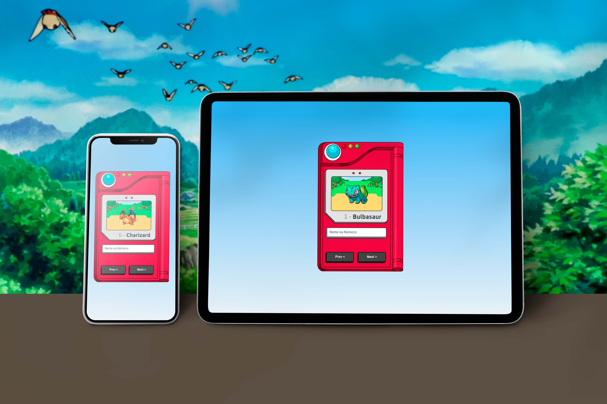

<h1 align="center"> Pokédex [Luan Ferreira] </h1>

  <a href="#-tecnologias">Tecnologias</a>&nbsp;&nbsp;&nbsp;|&nbsp;&nbsp;&nbsp;
  <a href="#-projeto">Projeto</a>&nbsp;&nbsp;&nbsp;|&nbsp;&nbsp;&nbsp;
  <a href="#memo-licença">Licença</a>

  

 

## 🚀 Tecnologias

Esse projeto foi desenvolvido com as seguintes tecnologias:

- HTML
- CSS
- JavaScript

## 💻 Projeto
 
 Projeto consumindo API PokéAPI onde podemos pesquisar pelo ID ou Nome do pokemon.
 

## 🖥️ [Veja o site no ar](https://rfluan.github.io/pokedex/)

## :memo: Licença

Esse projeto está sob a licença MIT.

---

Feito com ♥ by Luan Ferreira :wave:
